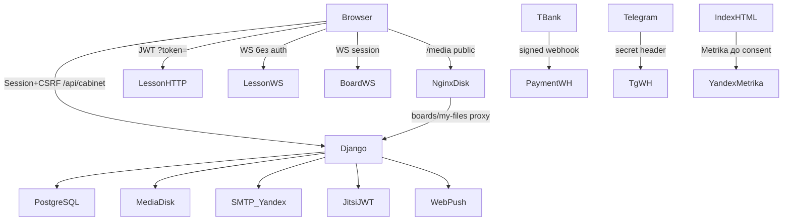

# Комплексный аудит безопасности и персональных данных — itflux

**Дата аудита:** 6 августа 2026  
**Ветка:** `security/privacy-audit-2026-08`  
**Метод:** статический анализ кода, трассировка цепочек frontend → API → ORM, проверка конфигов деплоя в репозитории, выборочная проверка тестов.  
**Ограничение:** это не внешний pentest и не проверка живого production. Сервер Ubuntu, firewall, DNS/TLS на проде, фактическое расположение БД/бэкапов и реестр Роскомнадзора требуют отдельной ручной проверки.

Юридические выводы ниже опираются на текст Федерального закона от 27.07.2006 № 152-ФЗ «О персональных данных» (актуальность формулировок — по официальной публикации на pravo.gov.ru / консультантским редакциям на дату аудита). Там, где требуется оценка оператора/юриста, это указано явно.

---

## 1. Executive summary

| Показатель | Оценка |
|---|---|
| Общий уровень риска | **Высокий** |
| Critical | 4 |
| High | 9 |
| Medium | 14 |
| Low / Informational | 12+ |
| Можно ли безопасно продолжать активную эксплуатацию/продвижение? | **С ограничениями:** кабинетные API в целом scoped, но публичные media, открытые WebSocket урока, утечки в Git и пробелы политики ПДн требуют закрытия до масштабирования |
| Что закрыть до активного продвижения | C-01…C-04, H-01…H-05, согласование документов ПДн |

**Сильные стороны (уже есть):**
- DRF default `IsAuthenticated` + session auth;
- TeacherScopedMixin / roster-scoped student querysets — классический IDOR «подменил ID чужого ДЗ» в основном закрыт;
- Parent invite tokens хэшируются; revoke связи родителя покрыт тестами;
- Interactive boards / video meetings WS требуют session + object ACL;
- Homework JWT привязан к `homework_assignment_id`;
- T-Bank webhook проверяет Token;
- Login/register имеют rate limit (10 / 900 с);
- «Мои файлы» и доски закрыты от прямого `/media/`.

**Главные риски:**
1. Прямой публичный доступ к `/media/cabinet/homework/` и `/media/cabinet/materials/`.
2. WebSocket `ws/lesson/<room_id>/` без JWT — подмена роли учителя, чтение/запись ответов.
3. В Git лежат дампы БД, sqlite, media и скрипт с учётными данными.
4. Политика конфиденциальности не отражает кабинет, платежи, Telegram, Jitsi, push и несовершеннолетних.

---

## 2. Архитектура и потоки данных

### 2.1. Компоненты

| Компонент | Расположение | Назначение |
|---|---|---|
| Django apps | `Generator`, `Board`, `Cabinet` | Контент/уроки, legacy-доска, личный кабинет |
| Settings (активные) | `Generator/settings.py` (`DJANGO_SETTINGS_MODULE=Generator.settings`) | Prod/dev конфиг |
| Settings (legacy) | `Generator/Generator/settings.py` | Риск при ошибочном запуске (`CORS_ALLOW_ALL_ORIGINS`) |
| Frontend | `frontend/` (React 19 + Vite 7) | SPA, cookie-session + CSRF |
| ASGI | `Generator/asgi.py` + Channels | HTTP + WebSocket |
| Deploy | `deploy/nginx.conf`, `deploy/gunicorn.service` (Daphne), cron | Ubuntu VPS |
| DB | PostgreSQL (`DATABASES` из env) | Основное хранилище ПДн |
| Media | `MEDIA_ROOT` / nginx `/media/` | Файлы пользователей и контент |
| Внешние | T-Bank, Telegram, Jitsi, Yandex (Metrika/Telemost/SMTP), Web Push (VAPID), api.qrserver.com | Получатели данных / интеграции |

### 2.2. Роли

`Profile.Role`: `student` | `teacher` | `parent` (+ Django `is_staff`/`is_superuser` для admin).  
Админ-панель: стандартный Django admin по `/admin/`.

### 2.3. Схема потоков (упрощённо)

### 2.4. Таблица обработки (фрагмент ключевых потоков)

| Источник | Endpoint / канал | Обработчик | Модель / хранилище | Получатель | Основание (оценка) | Срок хранения |
|---|---|---|---|---|---|---|
| Регистрация | `POST /api/cabinet/register/` | `Cabinet/views.py` | `User`, `Profile` | Оператор | Согласие / договор (нужна юр. квалификация) | Пока аккаунт активен; процедура удаления — проверить |
| Ученик (карточка) | `/api/cabinet/students/` | Teacher ViewSet | `Student` (ФИО, email, phone, parent_contact) | Учитель, связанный родитель | Исполнение договора обр. услуг | Пока связь/учётка; soft archive |
| Инвайт ученика | `/invite/:token`, API invitations | `invitations.py` | `StudentInvitation.token` **plaintext** | Учитель, приглашённый | Согласие/приглашение | До accept/expiry |
| Инвайт родителя | `/parent/invite/…` | `parent_invitations.py` | `token_hash` | Родитель, учитель | Представительство ребёнка | До accept/expiry |
| ДЗ / ответы | homework API + JWT | `homework_api.py` | `HomeworkSubmission`, файлы | Учитель, ученик, родитель (perm) | Обр. процесс | Не формализован |
| Журнал | `/api/cabinet/journal/…` | `journal_api.py` | `StudentLessonRecord` (+ `private_note`) | Учитель; ученик/родитель без private_note | Обр. процесс | Не формализован |
| Файлы кабинета | `/api/cabinet/files/…` | `files_api.py` | `CabinetFile` | Владелец / shared | Обр. процесс | Trash N дней |
| Публичный media | `GET /media/cabinet/homework|materials/…` | nginx alias / `media_serve` | Файлы на диске | **Любой, кто знает URL** | **Нарушение конфиденциальности** | Пока файл на диске |
| Урок live | `ws/lesson/<room_id>/` | `LessonConsumer` | answers/results + broadcast | Участники комнаты **и любой с room_id** | Обр. процесс | Результаты в БД |
| Платежи SaaS | `/payments/webhook/tbank/` | `PaymentWebhookView` | `Payment`, webhook payload | Оператор, T-Bank | Договор / закон о платежах | Фин. срок (не формализован в коде) |
| Биллинг репетитора | `/api/cabinet/billing/…` | `billing_api.py` | суммы, статусы учеников | Учитель; **peer leak в badge** | Договор с родителем/учеником | Не формализован |
| Push | `/api/cabinet/push/…` | `push_api.py` | endpoint, p256dh, auth | Браузерный push-сервис | Согласие на уведомления | Пока подписка |
| Telegram | connect + webhook | `telegram_*` | chat_id, username | Telegram (иностранный сервис) | Согласие; **трансграничная передача** | Пока связь |
| Jitsi | join-config JWT | `jitsi_service.py` | display name, room | Jitsi-сервер (зависит от `JITSI_DOMAIN`) | Обр. процесс / согласие | Сессия урока |
| Аналитика | `index.html` Metrika | Яндекс.Метрика + webvisor | IP, cookie, URL (в т.ч. с token) | Яндекс | Согласие на cookies (факт: грузится до баннера) | По политике Яндекса |

---

## 3. Найденные уязвимости

### C-01 — Публичный доступ к файлам ДЗ и материалов
- **Severity:** Critical  
- **CWE:** CWE-284 / CWE-552  
- **OWASP:** A01 Broken Access Control; API1 BOLA  
- **Файлы:** `Generator/Generator/urls.py:14-23`; `deploy/nginx.conf:129-131`; `Cabinet/models.py` (`cabinet/materials/`, `cabinet/homework/`); `Cabinet/files_services.py:1247-1254`  
- **Endpoint:** `GET /media/cabinet/homework/…`, `GET /media/cabinet/materials/…`  
- **Роли:** Гость  
- **Условия:** Известен или угадан path (утечка из API/Referer/логов)  
- **Сценарий:** Открыть URL файла без сессии → содержимое отдаётся nginx с диска  
- **Ущерб:** Утечка ответов учеников, методичек, ПДн в файлах  
- **Исправление:** Закрыть префиксы в nginx+Django; отдавать только через ACL API; не возвращать сырой `material.file.url`  
- **Тесты:** `Cabinet/tests_security_audit.py`  
- **Статус:** Исправлено в ветке `security/privacy-audit-2026-08` (нужен деплой nginx)  

### C-02 — WebSocket урока без аутентификации
- **Severity:** Critical  
- **CWE:** CWE-306 / CWE-639  
- **OWASP:** A01 / A07  
- **Файлы:** `Generator/Generator/consumers.py:44-119`; `Generator/Generator/templates/lesson_room.html:1095`  
- **Endpoint:** `ws/lesson/<room_id>/`  
- **Условия:** Известен `room_id` (из JWT/ссылки/логов)  
- **Сценарий:** Подключиться без токена → получать события, слать `join` с `role=teacher`, менять variant, писать ответы  
- **Ущерб:** Перехват live-урока, порча результатов, подмена учителя  
- **Исправление:** JWT в query WS; роль только из JWT; privileged events только для teacher  
- **Статус:** Исправлено в ветке (JWT на connect; роль из токена)  

### C-03 — Секреты и дампы в Git
- **Severity:** Critical (при публичном или широком доступе к репо)  
- **CWE:** CWE-798 / CWE-312  
- **Файлы:** `sync_from_prod.py:11-14`; `dumps/*.dump`; `db.sqlite3`; `Generator/media/cabinet/**` (частично tracked); `deploy/post_deploy.sh` (admin/admin)  
- **Ущерб:** Утечка ПДн учеников/учителей, компрометация админки, credential stuffing  
- **Исправление:** Убрать из индекса, ротировать все секреты, которые когда-либо светились; не хранить prod dumps в repo  
- **Статус:** Частично — `sync_from_prod.py` санирован; purge history dumps/sqlite/media + ротация — **ops вручную**  

### C-04 — Политика ПДн не соответствует фактической обработке кабинета
- **Severity:** Critical (комплаенс / доверие; не RCE)  
- **Нормы:** 152-ФЗ ст. 5 (принципы), ст. 9 (согласие), ст. 18.1 (меры), ст. 22 (уведомление РКН) — требуется юр. проверка  
- **Файлы:** `frontend/src/pages/PrivacyPage.jsx`  
- **Проблема:** Документ описывает сайт без обязательной регистрации; не перечисляет кабинетные ПДн (ФИО, телефон, журнал, платежи), Telegram, Jitsi, T-Bank, push, несовершеннолетних, сроки, права субъекта в полном объёме  
- **Статус:** Требует юридической редакции (не закрывается только кодом)  

### H-01 — Legacy Board WebSocket без auth
- **Severity:** High  
- **Файлы:** `Board/consumers.py:6-33`  
- **Статус:** Исправлено (reject unauthenticated)  

### H-02 — Billing badge раскрывает финансы одногруппников
- **Severity:** High  
- **Файлы:** `Cabinet/billing_api.py:832-849`; `Cabinet/billing_service.py:3884-3932`  
- **Endpoint:** `GET /api/cabinet/billing/events/<event_id>/badge/`  
- **Сценарий:** Ученик на групповом уроке видит суммы/статусы оплаты других  
- **Статус:** Исправлено  

### H-03 — Race на accept student invite
- **Severity:** High  
- **Файлы:** `Cabinet/invitations.py:204-304` (нет `select_for_update`, в отличие от parent)  
- **Статус:** Исправлено (`select_for_update(of=("self",))`)  

### H-04 — Student invite token в plaintext + в API/admin
- **Severity:** High  
- **Файлы:** `Cabinet/models.py:356`; `serializers.py` (token field); `admin.py:146`  
- **Статус:** Частично — token убран из admin list_display; hash — план 30 дней  

### H-05 — Саморегистрация учителя + promo Pro
- **Severity:** High (бизнес/абонемент)  
- **Файлы:** `Cabinet/views.py:148-235`  
- **Примечание:** Может быть продуктовым решением; как abuse-вектор — ограничить invite-only / captcha / ручная модерация  
- **Статус:** Продуктовое решение + мониторинг  

### H-06 — Yandex OAuth tokens в Django admin Profile
- **Severity:** High  
- **Файлы:** `Cabinet/admin.py:80-87` (не exclude `yandex_oauth_token` / `yandex_refresh_token`)  
- **Статус:** Исправлено  

### H-07 — Загрузка SVG/HTML/JS в allowlist
- **Severity:** High (XSS при раздаче inline)  
- **Файлы:** `Cabinet/upload_validation.py:9-41`  
- **Статус:** Частично — material file API отдаёт HTML/SVG/JS как attachment + nosniff; полный запрет upload — план  

### H-08 — JWT/invite в URL + Metrika webvisor до consent
- **Severity:** High (privacy)  
- **Файлы:** `frontend/index.html` (Metrika); homework `?token=`; `Layout.jsx` cookie banner  
- **Статус:** План: gate Metrika; не логировать token в analytics  

### H-09 — systemd unit от root + default admin/admin в post_deploy
- **Severity:** High (infra)  
- **Файлы:** `deploy/gunicorn.service`; `deploy/post_deploy.sh`  
- **Статус:** Требует доступа к серверу  

### M-01 — InteractiveAttempt create без проверки teacher ownership
- **Severity:** Medium — `Cabinet/api_views.py` ~1430; serializers — **исправлено**  
### M-02 — PATCH subject `plan_id` может взять чужой archived plan
- **Severity:** Medium — `Cabinet/api_views.py:293-319`  
### M-03 — Parent invite preview раскрывает ФИО при наличии token
- **Severity:** Medium — ожидаемо для invite, минимизировать поля  
### M-04 — Dual settings с `CORS_ALLOW_ALL_ORIGINS`
- **Severity:** Medium — `Generator/Generator/settings.py`  
### M-05 — `CHANNEL_LAYERS = InMemoryChannelLayer`
- **Severity:** Medium (multi-worker WS isolation/sync)  
### M-06 — CSRF cookie не HttpOnly (для SPA)
- **Severity:** Medium при XSS  
### M-07 — Homework token в query string (Referer/logs)
- **Severity:** Medium — `LK_HOMEWORK_APPEND_TOKEN_QUERY`  
### M-08 — Open redirect trust: `payment_url`, SW `openWindow`, deep_link
- **Severity:** Medium — frontend  
### M-09 — Task HTML → `innerHTML` без sanitizer (`MathContent.jsx`)
- **Severity:** Medium/High — stored XSS если контент банка скомпрометирован  
### M-10 — QR invite через api.qrserver.com (третья сторона получает URL токена)
- **Severity:** Medium  
### M-11 — Нет Django LOGGING / audit trail админских действий
- **Severity:** Medium  
### M-12 — Нет MFA для admin
- **Severity:** Medium  
### M-13 — Default DB password fallback `postgres`
- **Severity:** Medium  
### M-14 — VAPID keys отсутствуют в production `.env.example`
- **Severity:** Low/Medium  

### L / Info
- Meeting UUID existence oracle (403 vs 404)  
- Student lesson detail может отдать unpublished materials внутри assignment  
- Privacy page: «implied consent» при использовании сайта — спорно относительно ст. 9 152-ФЗ  
- Нет CI / secret scanning  
- Нет automated backups в repo  
- Source maps в prod по умолчанию off (ок)  
- Session cookie SameSite=Lax (ок для same-site SPA)

---

## 4. Матрица доступа (ключевые endpoints)

| Endpoint | Метод | Гость | Ученик | Родитель | Учитель | Админ | Проверка владельца | Результат аудита |
|---|---|---|---|---|---|---|---|---|
| `/api/cabinet/login/` | POST | ✓ | ✓ | ✓ | ✓ | ✓ | n/a | Rate limit есть |
| `/api/cabinet/register/` | POST | ✓ | — | invite | self | — | роль из body | Teacher self-signup |
| `/api/cabinet/students/<id>/` | * | ✗ | ✗ | ✗ | own | ✓ | teacher= | OK |
| `/api/cabinet/student/homework/<id>/` | GET | ✗ | own roster | — | — | ✓ | roster qs | OK |
| `/api/cabinet/parent/…` | * | ✗ | ✗ | active child | invite mgmt | ✓ | relationship | OK + revoke tested |
| `/api/cabinet/billing/events/<id>/badge/` | GET | ✗ | participant | ✗ | owner | ✓ | coarse | **Peer leak** |
| `/media/cabinet/my-files/…` | GET | ✗ | API | — | API | ✓ | ACL | OK forbidden |
| `/media/cabinet/homework/…` | GET | **✓** | ✓ | ✓ | ✓ | ✓ | **нет** | **Critical** |
| `/media/cabinet/materials/…` | GET | **✓** | ✓ | ✓ | ✓ | ✓ | **нет** | **Critical** |
| `/api/homework/assignment/<id>/` | * | JWT | session | — | teacher | ✓ | token bind | OK |
| `ws/lesson/<room>/` | WS | **✓** | **✓** | — | **✓** | — | **нет** | **Critical** |
| `ws/interactive-boards/<uuid>/` | WS | ✗ | ACL | — | owner | ✓ | permission | OK |
| `ws/video-meetings/<uuid>/` | WS | ✗ | ACL | ACL | ACL | ✓ | resolve_access | OK |
| `ws/board/<room>/` | WS | **✓** | ✓ | ✓ | ✓ | ✓ | нет | High |
| `/payments/webhook/<provider>/` | POST | ✓ signed | — | — | — | — | Token | OK (DEBUG mock!) |
| `/admin/` | * | ✗ | ✗ | ✗ | staff | ✓ | Django perms | MFA нет |

Полный перечень `/api/cabinet/*` — см. `Cabinet/api_urls.py` (~390 строк). Большинство teacher viewsets фильтруют `teacher=request.user`.

---

## 5. Реестр персональных данных (сводка)

| Поле / категория | Модель | Субъект | Кто видит | Внешняя передача | Удаление |
|---|---|---|---|---|---|
| username, email, password hash | `auth_user` | все роли | сам, admin | — | аккаунт |
| name, surname, avatar | `Profile` | все | кабинет / аватар API | — | с профилем |
| yandex oauth/refresh | `Profile` | учитель | **admin UI** | Яндекс | revoke OAuth |
| ФИО, email, phone, parent_contact, notes | `Student` | ученик (часто несовершеннолетний) | учитель; родитель (ограниченно) | — | archive/delete student |
| Журнал: оценки, комментарии, private_note | `StudentLessonRecord` | ученик | учитель; private_note только учитель | — | ? |
| Ответы ДЗ, файлы | `HomeworkSubmission` | ученик | учитель/ученик/родитель(perm) | — | ? |
| Платежи SaaS | `Payment` | учитель | учитель, admin, T-Bank | T-Bank | фин. срок |
| Биллинг ученика | billing models | ученик/родитель | учитель; badge leak peers | — | ? |
| telegram_chat_id | `NotificationPreference` | все | сам | Telegram (трансгранично) | unlink |
| push keys | `PushSubscription` | все | сам | Push-сервис браузера | unsubscribe |
| invite email/name | invitations | ученик/родитель | учитель; preview по token | QR third-party | expiry |
| IP, UA заявок | TeacherApplication/Feedback | заявитель | admin | — | ? |
| Metrika identifiers | cookies | посетитель | Яндекс | Яндекс | opt-out |

**Несовершеннолетние:** данные учеников обрабатываются массово; отдельного согласия законного представителя в UI/модели как обязательного гейта для всех потоков не обнаружено (нужна юр. оценка ст. 9 / представительство).

---

## 6. Внешние сервисы и получатели данных

| Сервис | Данные | Страна / локализация | В политике? |
|---|---|---|---|
| PostgreSQL (VPS) | Все ПДн | **не подтверждено кодом** | частично |
| Nginx/media disk | Файлы | тот же хост | нет явно |
| T-Bank | платежи | РФ (типично) | **нет** |
| Telegram | chat_id, сообщения | инфраструктура Telegram (трансгранично вероятно) | **нет** |
| Jitsi (`JITSI_DOMAIN`, default meet.jit.si) | имя, медиа-сессия | зависит от деплоя | **нет** |
| Yandex Metrika | поведение, URL, webvisor | РФ / Яндекс | да |
| Yandex SMTP / Telemost / Calendar | email, OAuth | Яндекс | нет/частично |
| Web Push (FCM/Mozilla/Apple через браузер) | push endpoint | часто вне РФ | **нет** |
| Google Fonts / MathJax CDN | IP запроса | вне РФ возможно | **нет** |
| api.qrserver.com | URL с invite token | третья сторона | **нет** |

**Локализация (ст. 18 152-ФЗ о записи ПДн граждан РФ):** факт первичной записи в БД на территории РФ **не подтверждён** этим аудитом (нужен акт/договор хостинга). Трансграничная передача в Telegram/push/CDN требует оценки ст. 12 152-ФЗ.

---

## 7. Проверка документов

| Документ | Наличие | Соответствие системе |
|---|---|---|
| Политика конфиденциальности | `/privacy` RU | **Существенно устарела** относительно кабинета |
| Пользовательское соглашение / оферта | не найдено отдельным документом | пробел |
| Согласие на ПДн (фиксируемое) | частично (feedback `consent_given`) | нет версионированного consent log для регистрации |
| Cookie consent | баннер `cookie_consent_accepted` | **не блокирует Metrika** |
| Согласие законного представителя | не формализовано | пробел |
| Процедура удаления аккаунта | требует проверки UI/API | неполная документация |

---

## 8. Несоответствия законодательства и фактической системы

> Требуется проверка юристом / специалистом по защите ПДн. Ниже — инженерные наблюдения с отсылкой к нормам.

1. **Ст. 5 152-ФЗ (минимизация, ограничение срока):** в коде нет формализованных retention/purge политик для журнала, ответов, логов, бэкапов.  
2. **Ст. 9 (согласие):** implied consent в PrivacyPage; Metrika+webvisor до согласия; кабинетные цели не описаны.  
3. **Ст. 18.1 (меры):** часть мер есть (HTTPS в nginx шаблоне, password validators), но публичные media и открытый lesson WS ослабляют конфиденциальность.  
4. **Ст. 22 (уведомление РКН):** факт подачи уведомления **не проверялся** (нет артефакта в репо).  
5. **Ст. 12 (трансграничная передача):** Telegram / push / возможные CDN / default Jitsi — перечень не отражён в политике.  
6. **Ст. 18 (локализация):** место первичной записи ПДн **не подтверждено**.  
7. Противоречие: политика говорит о сайте без обязательной регистрации — кабинет требует учёток и хранит расширенные ПДн.

---

## 9. Проверка конфигурации production

### Из репозитория (шаблон)

| Контроль | Состояние |
|---|---|
| `DEBUG` из env, forbidden weak SECRET in prod | OK в `Generator/settings.py` |
| `ALLOWED_HOSTS` required in prod | OK |
| Secure cookies when `DEBUG=False` | OK |
| HSTS | только если задан `SECURE_HSTS_SECONDS` |
| CSRF_TRUSTED_ORIGINS | из env |
| CORS | prod: allowlist; nested settings — риск |
| nginx HTTP→HTTPS | есть в `deploy/nginx.conf` |
| Private media proxy | только boards/my-files |
| Daphne/systemd | **User=root** — риск |
| `python manage.py check --deploy` | запускать в правильном venv на сервере; локально возможны конфликты path models |

### Не проверено без доступа к серверу
- Реальные TLS cipher/протокол, HSTS preload  
- Firewall / SSH / fail2ban / root login  
- PostgreSQL listen addresses, TLS, superuser  
- Шифрование и доступ к бэкапам  
- Фактические security headers на проде  
- Содержимое `/etc/itflux/itflux.env`  
- Ротация ранее засвеченных секретов  

---

## 10. План исправлений

### Немедленно, до 24 часов
1. Закрыть `/media/cabinet/homework/` и `/media/cabinet/materials/` (nginx + Django) + API download.  
2. JWT-auth для `LessonConsumer` + роль из токена.  
3. Ограничить legacy `BoardConsumer`.  
4. Убрать credentials из `sync_from_prod.py`; прекратить раздачу dumps; начать ротацию секретов.  
5. Скрыть OAuth tokens в admin; фильтровать billing badge для ученика.  
6. `select_for_update` на student invite accept.

### До публичного запуска / активного продвижения
7. Hash student invite tokens.  
8. Санитизация HTML (`MathContent`) + запрет опасных upload preview.  
9. Gate Metrika по consent; scrub tokens из analytics URL.  
10. Allowlist `payment_url` / push openWindow.  
11. Исправить InteractiveAttempt / plan PATCH ownership.  
12. Обновить Политику/оферту/согласия (юрист).  
13. Redis channel layer в prod; non-root systemd.  
14. Удалить tracked dumps/media из git history (BFG/filter-repo) + ротация.

### В течение 30 дней
15. MFA admin; audit log; LOGGING без ПДн.  
16. Retention/deletion procedures; export/delete account API.  
17. Dependency audit в CI; secret scanning.  
18. Backup encryption + tested restore.  
19. Security regression suite (см. §25 запроса) расширить.

### Дальнейшее усиление
20. Внешний pentest; bug bounty; incident response runbook; регулярный SAST (bandit/semgrep).

---

## 11. Threat model (сводка)

| Нарушитель | Ключевой сценарий | Вероятность | Ущерб | Защита сейчас | Нужно |
|---|---|---|---|---|---|
| Гость | Скачать `/media/…/homework/…` | Высокая | Высокий | Частичный blocklist | C-01 |
| Гость | WS join к lesson room | Средняя | Высокий | Только знание room_id | C-02 |
| Ученик | Badge чужих платежей | Средняя | Средний | Auth only | H-02 |
| Два клиента | Double-accept invite | Средняя | Средний | atomic без lock | H-03 |
| Учитель | InteractiveAttempt на чужой assignment | Низкая | Средний | IsTeacher | M-01 |
| Украденная сессия | Полный доступ кабинета | Средняя | Высокий | HttpOnly session | MFA, session revoke |
| Вредоносный upload | SVG/HTML XSS | Средняя | Высокий | ext allowlist | sanitize/block |
| Бывший учитель | Доступ после блокировки | Низкая | Высокий | `account_blocked` в permissions | проверить все пути |
| Доступ к Git dumps | Массовая утечка ПДн | Зависит от доступа к repo | Критический | .gitignore (поздно) | purge+rotate |
| Admin insider | OAuth tokens / export | Средняя | Высокий | Django perms | exclude fields, MFA, audit |

---

## 12. Области, не покрытые этим аудитом

- Живой production pentest (auth bypass runtime, race на реальной нагрузке)  
- Содержимое prod БД / реальных бэкапов  
- Фактическая локализация и договорные поручения обработки  
- Реестр Роскомнадзора и текст уведомления  
- Полный npm/pip CVE triage с анализом reachability  
- Мобильные клиенты (если появятся)  
- Социальная инженерия / фишинг учителей  

**Формулировка результата:** проверены архитектура, ключевые API/WS/media/payments/privacy-документы и деплой-шаблоны в репозитории; найдены конкретные Critical/High; часть Critical исправляется в ветке аудита; комплаенс 152-ФЗ и инфраструктура сервера требуют отдельных контуров проверки.

---

## Приложение A. Автоматические security tests

Файл: `Cabinet/tests_security_audit.py` — **11 тестов OK** (`python manage.py test Cabinet.tests_security_audit --keepdb`).

Покрыто: запрет публичного media homework/materials; ACL скачивания материала; изоляция billing badge; повторный accept invite; register не даёт is_staff; OAuth exclude в admin.

Дополнительно прогнаны: `Cabinet.tests_parent_access`, `Cabinet.tests_my_files`, `Cabinet.tests_tbank_payment`.

### Dependency note (frontend)
`npm audit` (frontend, omit=dev): **15** issues в `react-router` / `react-router-dom` (DoS, open redirect, CSRF class advisories). Не обновлялось major без анализа совместимости — в план 30 дней.

`pip-audit` в окружении не установлен.

### `check --deploy` (локально, DEBUG=True)
W004 HSTS, W008 SSL redirect, W009 SECRET_KEY (dev), W012/W016 secure cookies, W018 DEBUG, W019 X_FRAME_OPTIONS. В prod при `DEBUG=False` cookies Secure включаются кодом; HSTS — через env; SSL redirect — на nginx.
